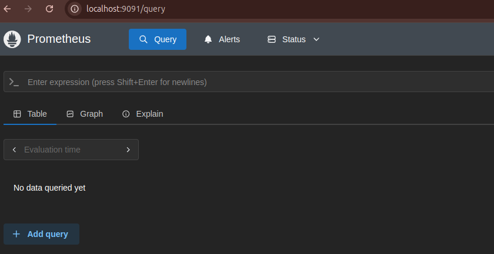
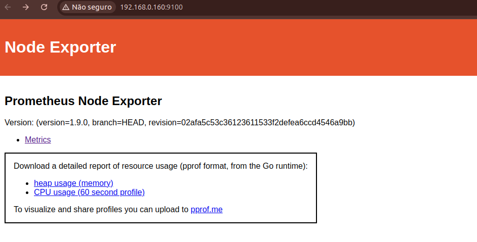

## Índice
* [Usando o Prometheus](#usando-o-prometheus)
  * [Executado o node_exporter localmente](#executado-o-node_exporter-localmente)

## Introdução <a name="introducao"></a>

O objetivo desse projeto e executar o Prometheus em docker local.

### Portas do network interno docker <a name="portas-do-network-interno-docker"></a>

As portas configuradas para as aplicações:

| APP | HTTP | HTTPS | OUTRO | DNS |
|---|---|---|---|---|
| Prometheus | 9090 | X | X | [http://localhost:9091](http://localhost:9090) |
| Prometheus Node | 9100 | X | X | [http://localhost:9100](http://localhost:9100) |


Para testar a porta:

```shell
telnet jenkins.local 9043
```

## Obter o IP do proxy <a name="obter-o-ip-do-proxy"></a>

Comando para obter o `ip` de um container:

```shell
docker inspect <nome_do_container> -f '{{range .NetworkSettings.Networks}}{{.IPAddress}}{{end}}' $(docker ps --filter name=reverse -q)
```

## Usando o Prometheus <a name="usando-o-prometheus"></a>

Para fins de demonstração, o Prometheus está sendo executado em um contêiner denominado `prometheus`. Para coletar métricas da máquina hospedeira, utilizaremos o `node_exporter`, um exporter específico para sistemas operacionais, disponível em [https://prometheus.io/download/](https://prometheus.io/download/). O `node_exporter` coletará diversas métricas de sistema, como utilização de CPU, memória, disco e rede, e as enviará para o Prometheus em intervalos regulares. Essas métricas serão armazenadas e disponibilizadas pelo Prometheus para visualização e análise.

#### Executado o node_exporter localmente <a name="executado-o-node_exporter-localmente"></a>

Execute o comando: `run-node-exporter.sh`

```shell
./run-node-exporter.sh
```

O endereço do `prometheus` é [http://localhost:9100](http://localhost:9100).

Para que o `prometheus` acesse o `node_exporter`, o container sobe com a seguinte configuração do arquivo `prometheus/prometheus.yml`:

- Local do volume: `prometheus/prometheus.yml`
- Configuração do `static_configs`: http://192.168.0.160:9100/

Acessando o Prometheus.



Acessando o Node Exporter:



---

**Observação**: Para usar o `node_exporter` no windows, usar diretamente o arquivo `node_exporter-1.9.0.darwin-amd64.tar.gz`. O comando `run-node-exporter.sh` é apenas para comandos linux.

---
